# Mermaid Diagrams

Blazorade Scraibe has built-in support for [Mermaid](https://mermaid.js.org/) diagrams. Write a fenced code block with the `mermaid` language identifier and the diagram is rendered as an interactive, scalable graphic in the browser — nothing else required.

For runtime context on how diagram content is published and enhanced, see [Architecture positioning](../core/architecture-positioning.md) and [Runtime glossary](../core/runtime-glossary.md).

````markdown
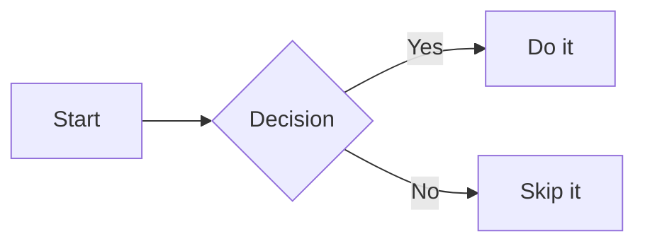
````

Fenced `mermaid` blocks are powered by the [Mermaid shortcode component](./shortcodes/mermaid.md). Anyone interested in the underlying implementation can start there.

## Supported Diagram Types

Blazorade Mermaid renders any diagram type supported by [Mermaid 11](https://mermaid.js.org/). All types listed in the official Mermaid documentation are available — the examples below cover the full set.

### Flowchart

Describes processes, decisions, and data flows.

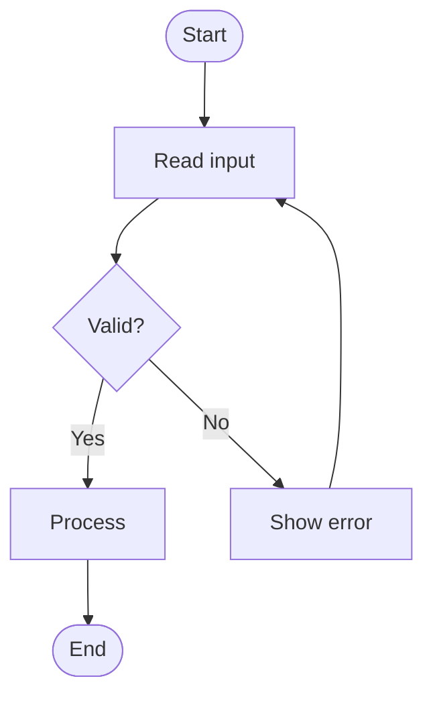

Direction keywords: `TD` (top-down), `LR` (left-right), `BT` (bottom-top), `RL` (right-left).

### Sequence Diagram

Shows interactions between participants over time.

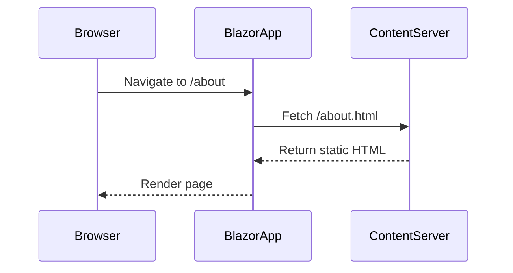

### Class Diagram

Describes object-oriented structures and relationships.

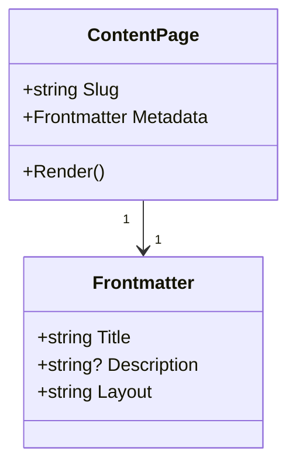

### State Diagram

Models states and transitions, useful for workflows or UI logic.

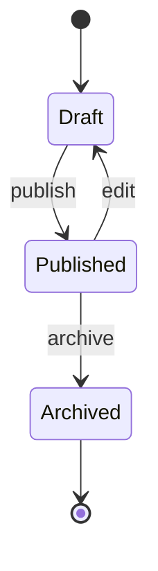

### Entity Relationship Diagram

Documents data models and their relationships.

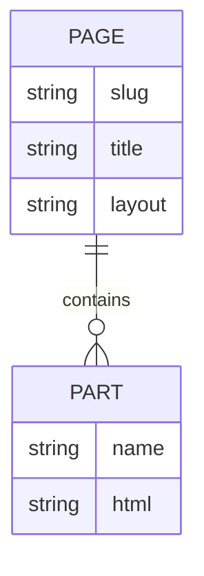

### Gantt Chart

Visualises project schedules and timelines.

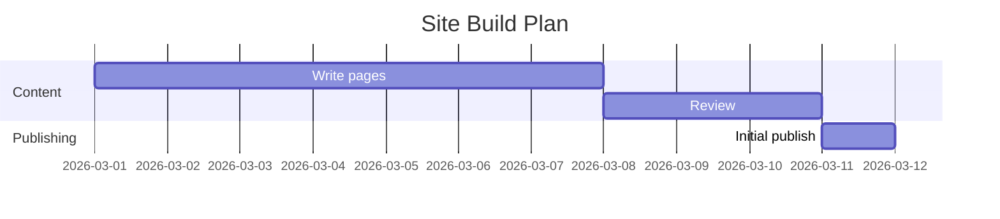

### Pie Chart

Shows proportional data as a labelled pie.

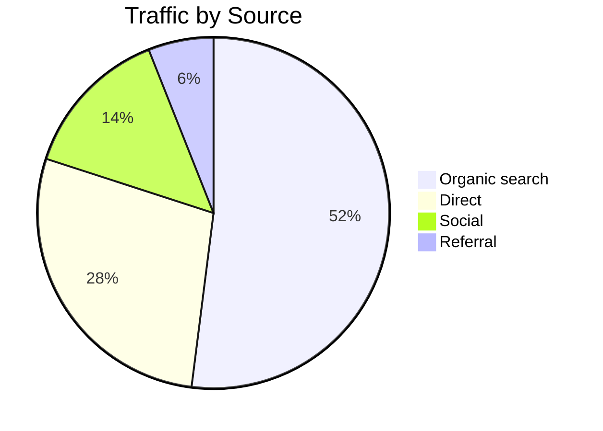

### Git Graph

Illustrates branch and commit history.

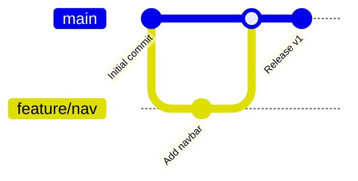

### User Journey

Maps the steps a user takes through a process and scores the experience at each step.

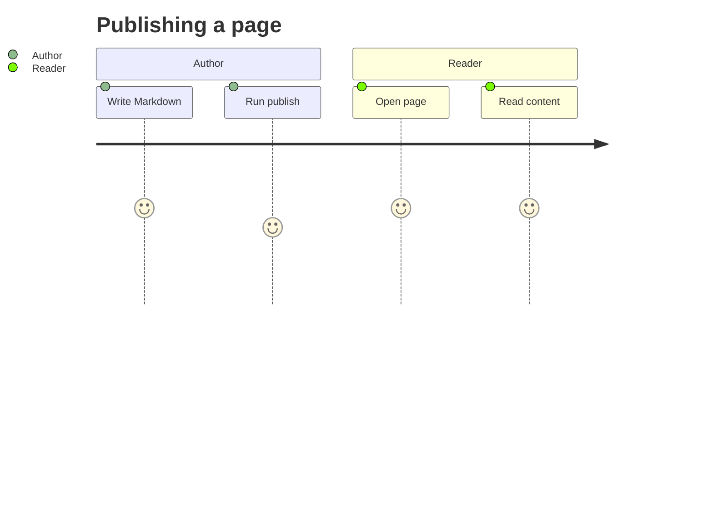

### Quadrant Chart

Plots items on a two-axis quadrant for prioritisation or comparison.

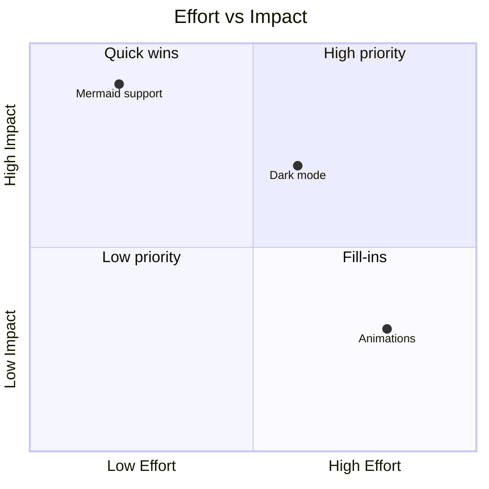

### Requirement Diagram

Documents requirements and their relationships to system elements.

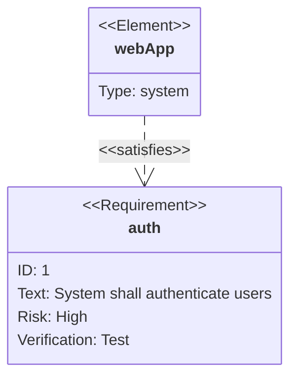

### C4 Diagram

Models software architecture at different levels of abstraction (Context, Container, Component, Code).

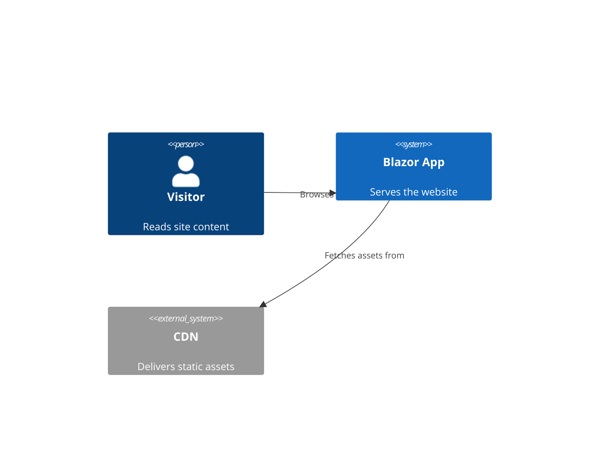

### Mindmap

Visualises hierarchical concepts branching from a central idea.

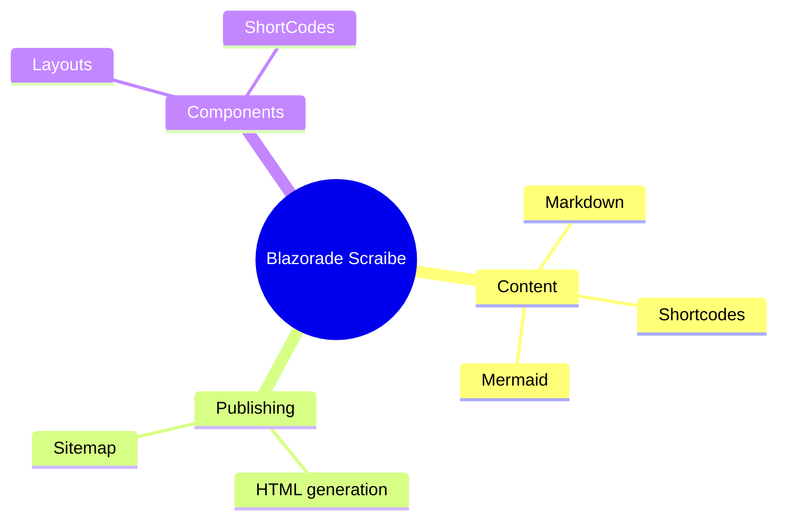

### Timeline

Shows events or milestones along a chronological axis.

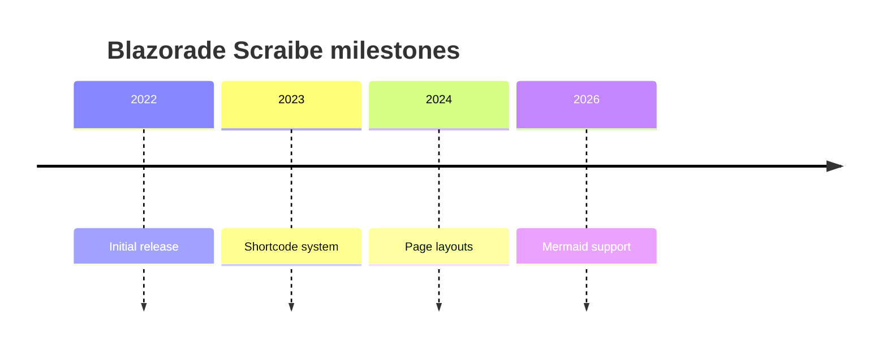

### Sankey Diagram

Visualises flow quantities between nodes — useful for showing traffic, energy, or data movement.

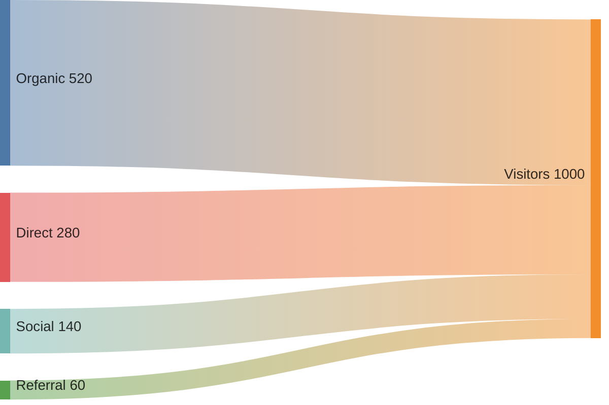

### XY Chart

Renders bar and line charts on XY axes for quantitative data.

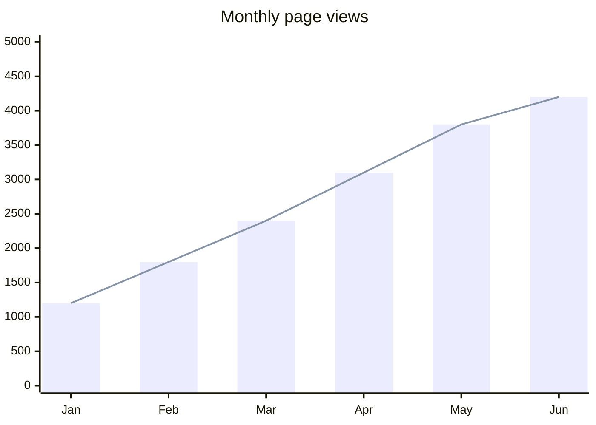

### Block Diagram

Describes systems as labelled blocks and connections — simpler than flowcharts for high-level architecture sketches.

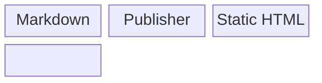

### Packet Diagram

Shows network packet structure and bit-field layouts.

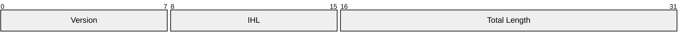

### Kanban

Visualises work items distributed across workflow stages.

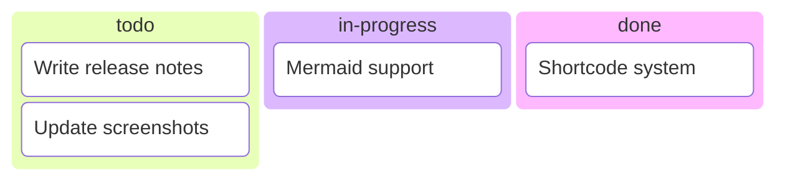

### Architecture Diagram

Describes infrastructure and service topology with icons for common resource types.

```mermaid
architecture-beta
    service browser(internet)[Browser]
    service cdn(server)[CDN]
    service app(server)[Blazor App]
    browser:R --> L:cdn
    cdn:R --> L:app
```

### Radar Chart

Compares multiple attributes of one or more subjects on a radial axis.

```mermaid
---
title: "Grades"
---
radar-beta
  axis m["Math"], s["Science"], e["English"]
  axis h["History"], g["Geography"], a["Art"]
  curve a["Alice"]{85, 90, 80, 70, 75, 90}
  curve b["Bob"]{70, 75, 85, 80, 90, 85}

  max 100
  min 0
```

### Treemap

Displays hierarchical data as nested rectangles, sized proportionally to a value.

```mermaid
treemap-beta
"Products"
    "Electronics"
        "Phones": 50
        "Computers": 30
        "Accessories": 20
    "Clothing"
        "Men's": 40
        "Women's": 40
```

## Writing Guidelines

- **One diagram per block.** Each fenced `mermaid` block contains exactly one diagram definition.
- **Add a description.** Precede every diagram with a short sentence explaining what it shows — this aids accessibility and makes the page readable even when diagrams cannot be rendered.
- **Keep diagrams focused.** If a diagram becomes hard to read, split it into two or more smaller diagrams, each covering a distinct concern.
- **Validate syntax.** Use the [Mermaid Live Editor](https://mermaid.live/) to preview and validate your diagram before adding it to a content file. Invalid syntax causes the diagram to fail silently at runtime.
- **Avoid very long labels.** Long text in nodes or edges makes diagrams hard to read on small screens. Use concise labels and explain details in surrounding prose.
- **Prefer diagrams over complex tables.** For relationships, flows, and hierarchies, a Mermaid diagram communicates the structure more clearly than a wide Markdown table.

## Example Page

A complete example showing diagram usage in context:

````markdown
---
title: Publish Pipeline
description: How the Blazorade Scraibe publish pipeline processes Markdown into static HTML.
---

# Publish Pipeline

The pipeline reads each Markdown file, processes shortcodes, converts to HTML, and writes
a static bootstrapper to `wwwroot/`. The diagram below shows the key stages.

```mermaid
flowchart LR
    A([.md file]) --> B[Parse frontmatter]
    B --> C[Process shortcodes]
    C --> D[Convert to HTML]
    D --> E[Apply layout template]
    E --> F([.html bootstrapper])
```

After publishing, the Blazor runtime fetches the bootstrapper and composes the final page
by splicing each content part into its layout slot.
````
