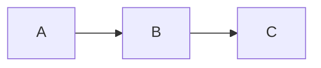

# Mermaid Shortcode

The `Mermaid` shortcode is a special-case shortcode generated automatically by the publish pipeline. Unlike other shortcodes, you do not write `[Mermaid ...]` tags directly.

For author-facing syntax, examples, diagram types, and writing guidance, see [Mermaid diagrams](../mermaid.md).

## Source syntax

Write a standard fenced code block with the language hint `mermaid`:

````

````

No explicit shortcode parameters are supported; the diagram definition is the child content.

## Publish-time processing

When the publish pipeline encounters a fenced block whose language hint is exactly `mermaid` (case-insensitive), it:

1. Removes the opening and closing fence lines from output.
2. Captures the raw diagram definition (leading and trailing blank lines trimmed).
3. Emits a wrapping shortcode sentinel in its place:

```html
<x-shortcode name="Mermaid" data-params='{}'>
graph TD
    A --> B
</x-shortcode>
```

The diagram definition travels as child content and is not processed by the Markdown converter.

All other fenced code blocks (non-`mermaid` language hints, or no hint at all) are left completely untouched.

## Notes

- There is no self-closing or explicit `[Mermaid /]` form.
- The diagram definition is passed verbatim to the Mermaid renderer.
