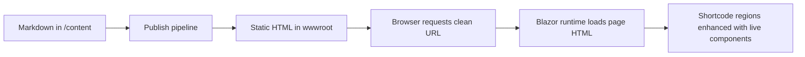

# Architecture positioning

Blazorade Scraibe is a static-content publishing model with Blazor WebAssembly runtime enhancement.

That means the primary artifact of the system is static HTML generated at publish time, while the Blazor runtime progressively enhances that content with live components where needed.

## Core model

Scraibe works across three execution contexts:

1. Authoring time: Content authors write Markdown and frontmatter in `/content`.
2. Publish time: The publisher converts Markdown to static HTML and writes output to `wwwroot`.
3. Runtime: The Blazor app fetches page HTML and enhances shortcode regions with live components.

This model gives crawler-visible static content and browser-side interactivity without requiring a server-rendered runtime.

## Why this model exists

The model is designed to satisfy two goals at the same time:

- Content must be visible to crawlers and AI bots without JavaScript execution.
- Pages can still provide interactive experiences through reusable Blazor components.

Scraibe treats static HTML as the baseline and interactivity as enhancement, not the reverse.

## Architecture flow

The flow below shows the lifecycle from content source to runtime rendering.

## Relationship to other pages

- Read [What Scraibe is and is not](what-scraibe-is-and-is-not.md) for boundaries and non-goals.
- Read [Constraints and rationale](constraints-and-rationale.md) for the design constraints that shape this model.
- Read [Publishing](../operations/publishing.md) for pipeline behavior and outputs.
- Read [Runtime glossary](runtime-glossary.md) for terminology used throughout these docs.
