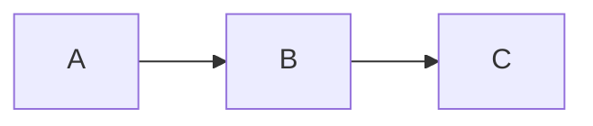
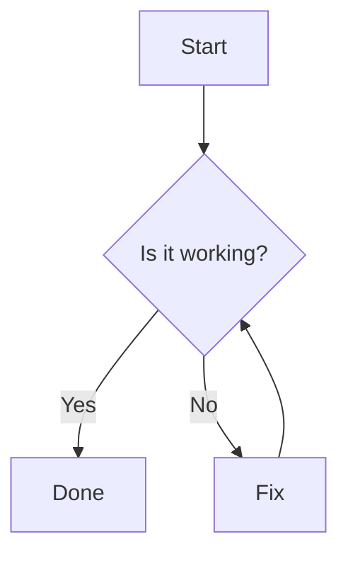
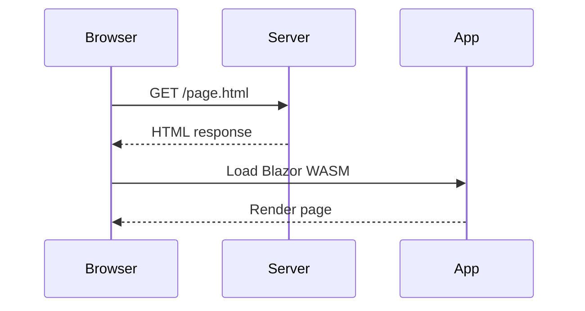

# Mermaid Shortcode

The `Mermaid` shortcode renders a [Mermaid](https://mermaid.js.org/) diagram inside a published page. Unlike most shortcodes, you never write it explicitly — the publish pipeline detects standard fenced `mermaid` code blocks in your content and converts them automatically. You just author Markdown as normal.

## Authoring syntax

Write a standard fenced code block with the language hint `mermaid`:

````

````

That is all. No shortcode tags, no extra parameters.

This syntax works in two contexts without any change:

- **VS Code preview** — the [Mermaid VS Code extension](https://marketplace.visualstudio.com/items?itemName=bierner.markdown-mermaid) renders the fenced block as a live diagram while you edit.
- **Published site** — the publish pipeline intercepts the fenced block, converts it to a `Mermaid` shortcode sentinel, and the Blazor app renders the diagram at runtime using [Blazorade Mermaid](https://github.com/Blazorade/Blazorade-Mermaid).

## Example — flowchart

The following source in a content file:

````

````

Renders as:


## Example — sequence diagram

The following source:

````

````

Renders as:


## How the pipeline processes the block

When the publish pipeline encounters a fenced block whose language hint is exactly `mermaid` (case-insensitive), it:

1. Removes the opening and closing fence lines from output.
2. Captures the raw diagram definition (leading and trailing blank lines trimmed).
3. Emits a wrapping shortcode sentinel in its place:

```html
<x-shortcode name="Mermaid" data-params='{}'>
graph TD
    Start --> Decision{Is it working?}
    ...
</x-shortcode>
```

The diagram definition travels as child content — it is **not** processed by the Markdown converter. At runtime, `ContentRenderer` instantiates the `Mermaid` shortcode component with the raw definition as `ChildContent`, which passes it to Blazorade Mermaid for rendering.

All other fenced code blocks (non-`mermaid` language hints, or no hint at all) are left completely untouched.

## Notes

- No parameters are supported or needed — the entire diagram definition is the child content.
- There is no self-closing or explicit `[Mermaid /]` form; always use a fenced block.
- The diagram definition is passed verbatim to the Mermaid renderer. Ensure it is valid Mermaid syntax.
